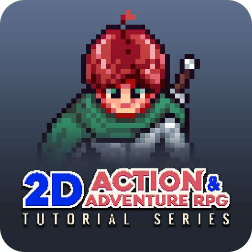

# 2D Action Adventure RPG Tutorial

*Michael Games /// https://www.youtube.com/@MichaelGamesOfficial /// https://michaelgames.itch.io/*

Code Repository for the Michael Games Action Adventure RPG Tutorial Series project.

This Code Repository contains the complete project (currently under development) for my YouTube tutorial series.

The series covers how to build a top down 2D game that features action, adventure and light RPG mechanics, in Godot 4 using GD Script.

Tutorial Series Playlist: https://www.youtube.com/playlist?list=PLfcCiyd_V9GH8M9xd_QKlyU8jryGcy3Xa
